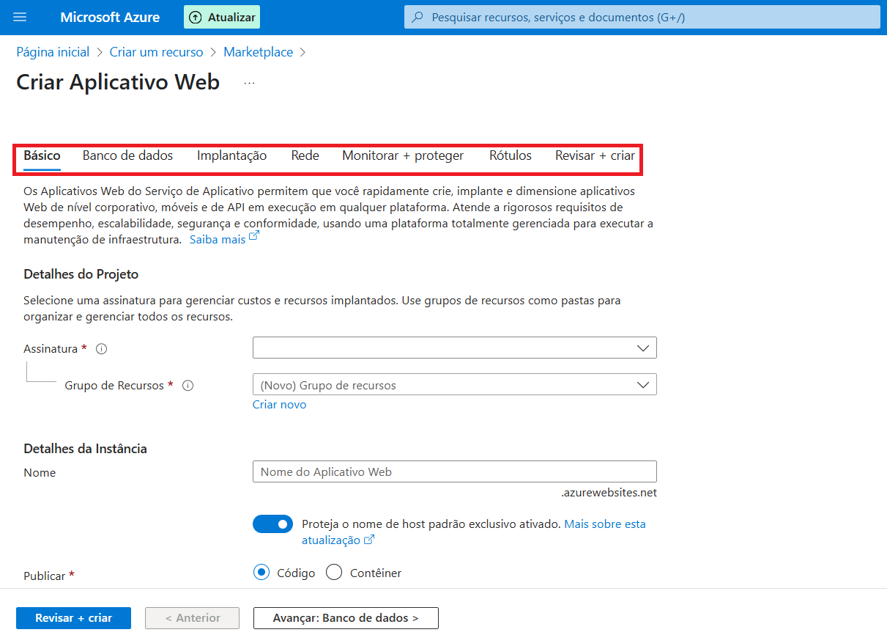

# Laboratório: API de Pagamentos Segura com Azure API Management e Microsoft Entra ID

## Objetivo
Implementar uma API de pagamentos protegida no Azure, utilizando o API Management (APIM) e Microsoft Entra ID para autenticação via tokens JWT e subscription keys.

## Ferramentas Utilizadas
- Azure Portal
- Postman

---

## 1. Provisionamento do API Management

### Criando o APIM
- No Azure Portal, selecione "Criar um recurso".

- Pesquise por "API Management" no Marketplace, clique em "Criar".

- Preencha os campos obrigatórios:
  - **Assinatura:** Selecione sua assinatura.
  - **Grupo de recursos:** Crie um novo ou selecione um existente.
  - **Região:** Escolha a mais próxima dos usuários.
  - **Nome do recurso, organização e e-mail do administrador:** Defina conforme sua preferência.

- Explore as abas adicionais antes de finalizar:
  - **Monitoramento:** Ative Log Analytics para acompanhar chamadas, erros e desempenho.
  - **Segurança:** Habilite o Defender para APIs para reforçar a proteção.
  - **Application Insights:** Ative para monitorar a performance da API.
  - **Identidade Gerenciada:** Ative para permitir autenticação segura entre serviços Azure.

- Escolha o plano adequado (Developer ou Basic para testes) e conclua a criação.

---

## 2. Criação do Aplicativo Web

- No Azure, clique em "Criar um recurso" e busque por "Aplicativo web".

- Preencha os detalhes:
  - **Assinatura e grupo de recursos:** Use os mesmos do APIM.
  - **Nome:** Defina conforme desejar.
  - **Publicação:** Escolha "Código" para facilitar o deploy.
  - **Stack de runtime:** Selecione a linguagem da sua API (ex: Python, Node.js).
  - **Região:** Mantenha igual ao APIM para otimizar latência.
  - **Plano de preços:** Utilize o padrão ou um já existente.
  - **Redundância de zona:** Não é necessário para ambientes de teste.

- Nas abas adicionais:
  - **Banco de dados:** Não é obrigatório para este laboratório.
  - **Implantação:** Desative autenticação básica.
  - **Rede:** Desative o acesso público, deixando o APIM como único ponto de entrada.

---

## 3. Configuração de CORS

- No aplicativo web, acesse as configurações de CORS.
- Habilite o recebimento de credenciais.

- Adicione o endereço do Gateway do APIM como origem permitida.

- Salve as alterações.

---

## 4. Publicação da API de Pagamentos no APIM

- No APIM, siga o fluxo para adicionar uma nova API.

- Selecione o aplicativo web criado como backend.

- Complete os campos e finalize a criação.

- Acesse a API recém-criada.

---

## 5. Ajustes de Rede e Subscription

- Configure o "Rewrite URL" para o backend correto.

- Defina o endpoint backend (ex: "weatherforecast") e salve.

- Altere os nomes dos parâmetros de subscription para `x-api-key`.

- Crie uma nova subscription e salve a chave primária.

---

## 6. Registro do Aplicativo no Microsoft Entra ID

- No Azure, acesse "Microsoft Entra ID".

- Siga o fluxo para registrar um novo aplicativo.

- Após o registro, copie o "ID do aplicativo (cliente)".

- Copie também o "Ponto de extremidade do token" e o "Documento de metadados".

- Gere uma nova secret e salve o valor.

- Crie funções (roles) para os usuários, como `sendMessage` e `Reader`.

---

## 7. Testando a Autenticação com Postman

- No Postman, insira os dados do aplicativo registrado:
  - `client_id`: ID do aplicativo.
  - `client_secret`: Valor da secret.
  - `grant_type`: `client_credentials`
  - `scope`: `https://graph.microsoft.com/.default`
- Use o endpoint de token para obter o JWT.

---

## 8. Permissões e Claims

- Cole o token JWT obtido no [jwt.io](https://jwt.io) para inspecionar os claims.

- Caso as roles não apareçam, ajuste as permissões do aplicativo no Azure e conceda consentimento.

- Aguarde alguns minutos e repita o teste.

---

## 9. Configurando a Validação do JWT no APIM

- No APIM, acesse a política "Validate JWT".

- Adicione os escopos necessários.

- Preencha os campos de "aud" e "iss" com os valores do token.

- Adicione a URL do OpenID.
- No Postman, envie requisições com os headers:
  - `x-api-key`: chave primária da subscription.
  - `Authorization`: esquema e token JWT.

- Se o token não tiver permissão, ajuste o escopo e o audience conforme necessário, seguindo as instruções do Azure e do jwt.io.

---

**Resumo:**  
Este laboratório demonstra como proteger uma API de pagamentos no Azure, integrando autenticação robusta via Microsoft Entra ID, gerenciamento de acesso com subscription keys e validação de tokens JWT no API Management.